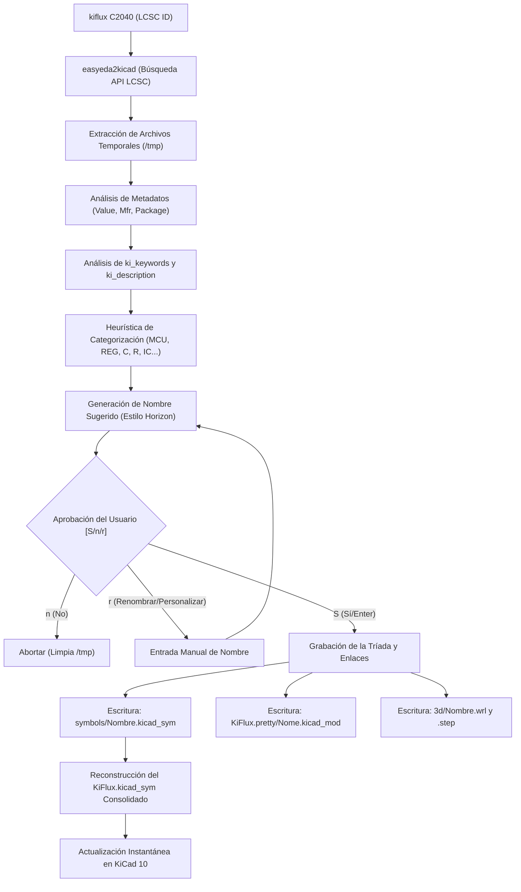

# ⚡ KiFlux: Gestor Inteligente de Bibliotecas y Exportador de BOM/CPL para KiCad

[](https://www.python.org/)
[](LICENSE)
[](https://kicad.org/)

Traducciones: [English](./README.md) | [Português (Brasil)](./README.pt-BR.md) | **Español**

> La biblioteca infinita de EasyEDA aliada a la filosofía de emparejamiento estricto de Horizon EDA. Automatizado, rápido y en tiempo real dentro de KiCad.

---

## 🌟 1. Filosofía de Diseño

**KiFlux** fue concebido para resolver la peor pesadilla en el diseño de circuitos impresos y PCBs: **la gestión caótica de bibliotecas**.

Tradicionalmente, los diseñadores pierden horas creando símbolos, dibujando huellas (footprints) y vinculando modelos 3D. Aunque herramientas como EasyEDA ofrecen una biblioteca gigantesca provista por LCSC, carecen de consistencia de nomenclatura y de control estricto de enlaces. Por otro lado, herramientas como Horizon EDA implementan la consistencia perfecta (el concepto de la "Tríada Inseparable"), pero carecen de importación rápida.

**KiFlux** une ambos mundos en un motor de terminal ligero, rápido e inteligente:
1.  **La Tríada Inseparable:** Un Símbolo, una Huella y un Modelo 3D comparten exactamente el mismo nombre estandarizado y enlaces internos.
2.  **Importación Instantánea:** Simplemente ingresa el código de LCSC (ej: `C2040`) y el CLI resuelve, descarga, limpia y publica el componente en tu biblioteca.
3.  **Visualización en Tiempo Real:** Conexión nativa con el sistema de archivos de KiCad 10 que actualiza las ventanas de selección de símbolos y huellas en el momento exacto de la importación.
4.  **Exportación en un Clic:** Genera listas de materiales (BOM) y de colocación (CPL) en el formato de fabricación exacto directamente en la carpeta del proyecto.

---

## 🚀 2. Instalación y Configuración

KiFlux es una herramienta de Python ligera y de código abierto (open-source). Para instalarla directamente desde este repositorio de GitHub con todas sus dependencias, ejecuta:

```bash
pip install git+https://github.com/oMatheus13/KiFlux.git
```
*(Nota: Asegúrate de tener **Python 3.8+** instalado en tu sistema. Este comando registrará el comando ejecutable global `kiflux` en tu terminal automáticamente.)*

---

## 🧬 3. Arquitectura del Sistema

El flujo de datos de **KiFlux** está diseñado para ser transparente, protegiendo la biblioteca local contra corrupciones y archivos duplicados.



---

## 📦 4. Convenciones de Nomenclatura

La convención de nombres utiliza *snake_case* y se basa estrictamente en la categoría del metadato oficial del componente en LCSC, eliminando los molestos sufijos del fabricante.

### A. Componentes Pasivos
Estructura: `PREFIJO_ENCAPSULADO_VALOR_FABRICANTE`
*   **Capacitores (`C_`):** `C_0805_100n_SAMSUNG`, `C_0402_10u_YAGEO`
*   **Resistores (`R_`):** `R_0603_10k_UNIROYAL`, `R_0805_0r1_UNIROYAL`

> [!NOTE]  
> La identificación de pasivos utiliza expresiones regulares estrictas (como `^\d+(\.\d+)?(p|n|u|m)?F?$`) para evitar que transceptores de radiofrecuencia (como `nRF24L01`) o reguladores de voltaje con las letras **F** o **R** en su valor sean confundidos con capacitores o resistores.

### B. Semicondutores, CIs y Activos
Estructura: `CATEGORÍA_MODELO_ENCAPSULAMENTO_FABRICANTE`
*   **Microcontroladores (`MCU_`):** `MCU_RP2040_QFN56_RPI`, `MCU_RP2350B_QFN80_RPI`, `MCU_ESP32_S3_QFN56_ESPRESSIF`
*   **Reguladores (`REG_`):** `REG_AMS1117_3_3_SOT223_AMS`, `REG_LM7805_TO220_TI`
*   **Diodos y Zeners (`DIODE_`):** `DIODE_1N4148_SOD323_CJ`
*   **Transistores y MOSFETs (`TRANS_`):** `TRANS_2N7002_SOT23_NXP`
*   **Circuitos Integrados Generales (`IC_`):** `IC_CH340G_SOIC16_WCH`, `IC_NRF24L01P-R_QFN20_NORDIC`

---

## 💻 5. Guía Rápida de Uso (Quickstart CLI)

Gestiona tus bibliotecas de KiCad directamente desde tu terminal utilizando el comando `kiflux`.

### 📥 Inicialización y Gestión de Componentes

*   **Asistente Guiado de Configuración Interactiva:**
    ```bash
    kiflux init
    ```
    *Inicia el asistente en tu terminal. Te preguntará dónde deseas guardar la biblioteca (por defecto: `~/KiCad/KiFlux`) y la registrará automáticamente en tu KiCad global. Si ejecutas cualquier comando de importación sin hacer esto antes, KiFlux te ofrecerá iniciar la configuración en el momento.*

*   **Actualización y Sincronización de la Biblioteca (`kiflux update`):**
    ```bash
    # Actualiza todos los componentes de la biblioteca
    kiflux update
    # Actualiza componentes específicos por LCSC ID o nombre local
    kiflux update C2040 MCU_RP2040_QFN56_RPI
    ```
    *Descarga los últimos metadatos y modelos 3D de la API de LCSC para los objetivos especificados (o escanea toda la biblioteca si no se especifican objetivos), actualizando valores y descripciones.*

*   **Importación Estándar (Nombre Completo Sugerido):**
    ```bash
    kiflux C2040
    ```
    *Busca el componente y sugiere el nombre estandarizado `MCU_RP2040_QFN56_RPI`. En el prompt:*
    *   **Confirmar (Enter / S):** Instala el componente con el nombre sugerido.
    *   **Personalizar (Teclear `r` o `r NOMBRE`):** Permite escribir un nombre personalizado de forma interactiva o inline.
    *   **Cancelar (Teclear `n`):** Aborta la importación.

*   **Importación en Lote:**
    ```bash
    kiflux C2040 C8791 C42415655
    ```
    *Importa automáticamente múltiples componentes LCSC en secuencia, solicitando confirmación para cada uno.*

*   **Forzar Nombre Personalizado:**
    ```bash
    kiflux C2040 MI_NOMBRE_PERSONALIZADO
    ```

*   **Renombrado Automático (Heurística de LCSC):**
    ```bash
    kiflux --rename C2040
    # o por su nombre local de componente
    kiflux --rename MCU_RP2040_QFN56_RPI
    ```

*   **Eliminación Limpia de Componentes:**
    ```bash
    kiflux --remove C2040
    # o por su nombre local de componente
    kiflux --remove MCU_RP2040_QFN56_RPI
    ```
    *Elimina el símbolo individual, la huella física, los archivos 3D y reconstruye la biblioteca consolidada.*

*   **Exportar BOM & CPL (Para Fabricación):**
    ```bash
    # En la carpeta del proyecto (guarda en la carpeta actual)
    kiflux bom
    # Indicando la carpeta del proyecto (guarda en la carpeta del proyecto)
    kiflux bom /ruta/al/proyecto
    # Indicando proyecto y una carpeta de salida diferente
    kiflux bom /ruta/al/proyecto /ruta/de/salida
    ```
    *Analiza los archivos `.kicad_sch` y `.kicad_pcb` y genera `BOM_JLCPCB.csv` and `CPL_JLCPCB.csv` listos para las máquinas de montaje.*

*   **Kits de Recetas de Componentes (Descarga Instantánea vía CDN):**
    ```bash
    # Lista todos los kits de hardware disponibles
    kiflux kit list
    # Muestra los componentes de un kit y si ya están instalados en tu computadora
    kiflux kit show master
    # Descarga e instala un kit completo en 2-3 segundos directo desde GitHub CDN
    kiflux install master
    ```
    *Descarga colecciones de componentes preseleccionados (como `master`, `maker`, `0603`, `0402`, `rp2040`, `rp2350b`) de forma instantánea a través de HTTP, extrae los archivos localmente y los fusiona en tu biblioteca consolidada de KiCad. Cuenta con fallback automático de seguridad para descarga individual desde la API de EasyEDA si estás sin conexión.*

---

### 🔍 Auditoría, Consultas y Utilidades

*   **Inventario de la Biblioteca (`kiflux list`):**
    ```bash
    kiflux list
    ```
    Muestra una tabla de todos los componentes registrados, sus códigos LCSC, fabricantes y estado del modelo 3D.

*   **Auditoría de la Biblioteca (`kiflux check`):**
    ```bash
    kiflux check
    ```
    Busca enlaces rotos, huellas faltantes o símbolos sin códigos LCSC en toda la biblioteca local.

*   **Ficha Técnica Fuera de Línea (`kiflux info`):**
    ```bash
    kiflux info C2040
    ```
    Muestra fabricante, MPN, encapsulado físico, enlace al datasheet y rutas físicas de archivos.

*   **Abrir Datasheet Instantáneamente (`kiflux datasheet`):**
    ```bash
    kiflux datasheet C2040
    ```
    Abre el enlace PDF del datasheet en tu navegador web predeterminado en segundo plano.

*   **Reconfigurar Ruta de la Biblioteca (`kiflux directory`):**
    ```bash
    kiflux directory /ruta/a/nueva/biblioteca
    ```
    Mueve la configuración y actualiza las rutas de las tablas globales `sym-lib-table` y `fp-lib-table` de KiCad.

---

## 🛠️ 6. Estructura Física de la Biblioteca

El directorio de la biblioteca está estructurado de la siguiente manera (asumiendo el nombre `KiFlux` como ejemplo):

```text
KiFlux/
├── config.json                     # Preferencias y rutas locales
├── KiFlux.kicad_sym                # Biblioteca consolidada leída por KiCad
├── KiFlux.pretty/                  # Carpeta de huellas nativas de KiCad
│   ├── MCU_RP2040_QFN56_RPI.kicad_mod
│   └── IC_CH340G_SOIC16_WCH.kicad_mod
├── symbols/                        # Símbolos individuales (apto para Git)
│   ├── MCU_RP2040_QFN56_RPI.kicad_sym
│   └── IC_CH340G_SOIC16_WCH.kicad_sym
└── 3d/                             # Modelos 3D asociados
    ├── MCU_RP2040_QFN56_RPI.wrl
    ├── MCU_RP2040_QFN56_RPI.step
    ├── IC_CH340G_SOIC16_WCH.wrl
    └── IC_CH340G_SOIC16_WCH.step
```

---

## 📄 7. Licencia

¡Este proyecto es de código abierto (open-source) y está bajo la **Licencia MIT**. Siéntete libre de usarlo, modificarlo y distribuirlo! Consulta el archivo [LICENSE](LICENSE) para más detalles.

---

## ❓ 8. FAQ (Preguntas Frecuentes)

### 1. ¿Puedo usar control de versiones (Git) en esta biblioteca?
**Sí, absolutamente.** KiFlux fue diseñado con Git en mente. Los símbolos se guardan individualmente en `symbols/` y el archivo consolidado `KiFlux.kicad_sym` se reconstruye automáticamente. Puedes hacer commit de las carpetas `symbols/`, `KiFlux.pretty/` y `3d/`. Se recomienda ignorar `KiFlux.kicad_sym` en tu `.gitignore` y ejecutar `kiflux --rebuild` después de clonar.

### 2. ¿Qué pasa si actualizo mi versión de KiCad?
Nada se rompe. KiFlux utiliza la sintaxis estándar S-expression de KiCad (versión 20231120+), que es altamente compatible hacia el futuro. Solo necesitas ejecutar `kiflux directory /ruta/a/biblioteca` si cambias de PC o de rutas globales de KiCad.
