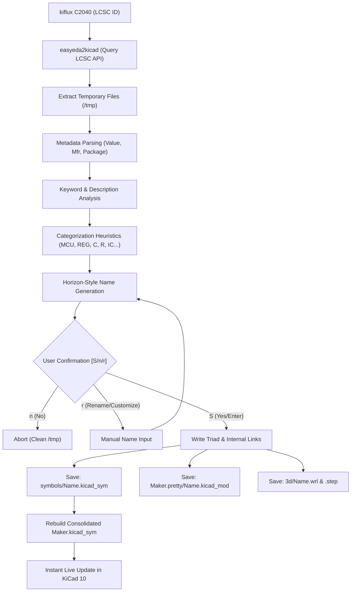

# ⚡ KiFlux: Smart Library Manager & BOM/CPL Exporter for KiCad

[](https://www.python.org/)
[](LICENSE)
[](https://kicad.org/)

Translations: **English** | [Português (Brasil)](./README.pt-BR.md) | [Español](./README.es.md)

> The infinite library of EasyEDA meets the strict component-matching philosophy of Horizon EDA. Automated, fast, and real-time within KiCad.

---

## 🌟 1. Design Philosophy

**KiFlux** was conceived to solve the biggest nightmare in PCB design: **chaotic library management**.

Traditionally, designers waste hours creating symbols, drawing footprints, and linking 3D models. While tools like EasyEDA offer massive libraries powered by LCSC, they often lack strict naming conventions and file-link integrity. On the other hand, tools like Horizon EDA implement the perfect consistency model (the "Inseparable Triad") but lack quick component importing.

**KiFlux** bridges these two worlds into a lightweight, fast, and intelligent CLI engine:
1.  **The Inseparable Triad:** Every schematic Symbol, PCB Footprint, and 3D Model shares the exact same standardized name and internal links.
2.  **Instant Import:** Just pass the LCSC part number (e.g., `C2040`) and the CLI automatically queries, downloads, cleans up, and publishes the component to your library.
3.  **Real-Time Visualization:** Native integration with KiCad 10’s file system ensures that your library updates instantly inside KiCad the moment you run the command.
4.  **One-Click Export:** Generates standardized BOM and CPL files ready for manufacturing directly from your project directory.

---

## 🧬 2. System Architecture

The data flow of **KiFlux** is designed to keep your local libraries safe, clean, and free of duplicate files.



---

## 📦 3. Naming Conventions

All imported components are automatically renamed using *snake_case* based on the physical parameters and official LCSC category, cleaning up messy manufacturer suffixes.

### A. Passive Components
Structure: `PREFIX_PACKAGE_VALUE_MANUFACTURER`
*   **Capacitors (`C_`):** `C_0805_100n_SAMSUNG`, `C_0402_10u_YAGEO`
*   **Resistors (`R_`):** `R_0603_10k_UNIROYAL`, `R_0805_0r1_UNIROYAL`

> [!NOTE]  
> Passive component identification uses strict regex matching (e.g. `^\d+(\.\d+)?(p|n|u|m)?F?$`) to prevent RF transceivers (like `nRF24L01`) or voltage regulators that contain letters **F** or **R** in their value from being miscategorized.

### B. Semiconductors, ICs and Actives
Structure: `CATEGORY_MODEL_PACKAGE_MANUFACTURER`
*   **Microcontrollers (`MCU_`):** `MCU_RP2040_QFN56_RPI`, `MCU_RP2350B_QFN80_RPI`, `MCU_ESP32_S3_QFN56_ESPRESSIF`
*   **Regulators (`REG_`):** `REG_AMS1117_3_3_SOT223_AMS`, `REG_LM7805_TO220_TI`
*   **Diodes & Zeners (`DIODE_`):** `DIODE_1N4148_SOD323_CJ`
*   **Transistors & MOSFETs (`TRANS_`):** `TRANS_2N7002_SOT23_NXP`
*   **General ICs (`IC_`):** `IC_CH340G_SOIC16_WCH`, `IC_NRF24L01P-R_QFN20_NORDIC`

---

## 💻 4. CLI Quickstart Guide

Manage your KiCad libraries directly from your terminal using the `kiflux` CLI tool.

### 📥 Component Importing & Management

*   **Standard Import (Suggested Naming):**
    ```bash
    kiflux C2040
    ```
    *Fetches the component and suggests the standardized name `MCU_RP2040_QFN56_RPI`. In the prompt:*
    *   **Confirm (Enter / S):** Installs the component with the suggested name.
    *   **Customize (Type `r` or `r NAME`):** Opens a prompt to type your own custom name, or renames inline.
    *   **Cancel (Type `n`):** Aborts the import.

*   **Batch Import:**
    ```bash
    kiflux C2040 C8791 C42415655
    ```
    *Automatically imports multiple LCSC parts in sequence, prompting for verification on each.*

*   **Force Custom Name:**
    ```bash
    kiflux C2040 MY_CUSTOM_NAME
    ```

*   **Automatic Re-naming (LCSC Heuristics):**
    ```bash
    kiflux --rename C2040
    # or by its local component name
    kiflux --rename MCU_RP2040_QFN56_RPI
    ```

*   **Clean Component Removal:**
    ```bash
    kiflux --remove C2040
    # or by its local component name
    kiflux --remove MCU_RP2040_QFN56_RPI
    ```
    *Deletes the individual symbol, footprint mod, 3D files, and rebuilds the consolidated library.*

*   **Export BOM & CPL (For Manufacturing):**
    ```bash
    # Run inside the project directory (exports to current folder)
    kiflux bom
    # Specify the project path (exports to project folder)
    kiflux bom /path/to/project
    # Specify project path and a different output folder
    kiflux bom /path/to/project /path/to/output
    ```
    *Scans `.kicad_sch` and `.kicad_pcb` files and exports `BOM_JLCPCB.csv` and `CPL_JLCPCB.csv` formatted exactly for assembly machines.*

---

### 🔍 Audit, Queries & Utilities

*   **Library Inventory (`kiflux list`):**
    ```bash
    kiflux list
    ```
    Shows a table of all registered components, their LCSC codes, manufacturers, and 3D model status.

*   **Library Audit (`kiflux check`):**
    ```bash
    kiflux check
    ```
    Audits the entire local library looking for broken links, missing footprints, or symbols lacking LCSC codes.

*   **Off-line Component Info (`kiflux info`):**
    ```bash
    kiflux info C2040
    ```
    Displays manufacturer, MPN, physical package, datasheet link, and local file paths.

*   **Open Datasheet Instantaneously (`kiflux datasheet`):**
    ```bash
    kiflux datasheet C2040
    ```
    Opens the PDF datasheet link in your default web browser in the background.

*   **Reconfigure Library Path (`kiflux directory`):**
    ```bash
    kiflux directory /path/to/new/library
    ```
    Moves the configuration and updates KiCad's global `sym-lib-table` and `fp-lib-table` paths.

---

## 🛠️ 5. Physical Library Structure

Your library directory is structured as follows:

```text
Maker/
├── config.json                     # Local preferences and paths
├── Maker.kicad_sym                 # Consolidated library file read by KiCad
├── Maker.pretty/                   # KiCad native footprints folder
│   ├── MCU_RP2040_QFN56_RPI.kicad_mod
│   └── IC_CH340G_SOIC16_WCH.kicad_mod
├── symbols/                        # Individual symbols (Git-friendly)
│   ├── MCU_RP2040_QFN56_RPI.kicad_sym
│   └── IC_CH340G_SOIC16_WCH.kicad_sym
└── 3d/                             # Associated 3D model files
    ├── MCU_RP2040_QFN56_RPI.wrl
    ├── MCU_RP2040_QFN56_RPI.step
    ├── IC_CH340G_SOIC16_WCH.wrl
    └── IC_CH340G_SOIC16_WCH.step
```

---

## ❓ 6. FAQ

### 1. Can I use Git version control on this library?
**Yes, absolutely!** KiFlux was designed with Git in mind. Símbols are saved individually in `symbols/`, and the main file `Maker.kicad_sym` is rebuilt automatically. You can commit the `symbols/`, `Maker.pretty/` and `3d/` folders. It is recommended to add `Maker.kicad_sym` to your `.gitignore` and run `kiflux --rebuild` after cloning.

### 2. What happens if I update my KiCad version?
Nothing breaks. KiFlux uses the standard KiCad S-expression syntax (version 20231120+), which is highly forward-compatible. You only need to run `kiflux directory /path/to/library` if you change your PC or KiCad global paths.
