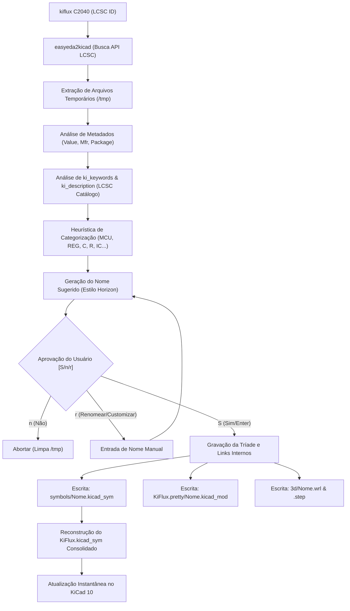

# ⚡ KiFlux: Gerenciador Inteligente de Bibliotecas e Exportador de BOM/CPL para KiCad

[](https://www.python.org/)
[](LICENSE)
[](https://kicad.org/)

Traduções: [English](./README.md) | **Português (Brasil)** | [Español](./README.es.md)

> A biblioteca infinita do EasyEDA aliada ao casamento estrito do Horizon EDA. Automatizado, rápido e em tempo real dentro do KiCad.

---

## 🌟 1. Filosofia de Design

O **KiFlux** foi concebido para resolver o maior pesadelo no design de circuitos integrados e PCBs: **o gerenciamento caótico de bibliotecas**.

Tradicionalmente, projetistas perdem horas criando símbolos, desenhando pegadas (footprints) e vinculando arquivos 3D. Ferramentas como o EasyEDA possuem uma biblioteca gigantesca fornecida pela LCSC, mas pecam na consistência de nomenclatura e no controle estrito de links. Ferramentas como o Horizon EDA implementam a consistência perfeita (o conceito da "Tríade Inseparável"), mas carecem de importação rápida.

O **KiFlux** une os dois mundos em um motor de terminal leve, rápido e inteligente:
1.  **A Tríade Inseparável:** Um Símbolo, um Footprint e um Modelo 3D compartilham exatamente o mesmo nome padronizado e links internos.
2.  **Importação Instantânea:** Basta passar o código da LCSC (ex: `C2040`) e o CLI resolve, baixa, formata e publica na biblioteca.
3.  **Visualização em Tempo Real:** Conexão nativa com a API do KiCad 10 que atualiza as janelas de seleção de símbolos e footprints no exato momento da importação.
4.  **Exportação em Um Clique:** Gera a BOM e o CPL no formato exato de fabricação direta na pasta do projeto.

---

## 🚀 2. Instalação e Configuração

O KiFlux é uma ferramenta Python leve e de código aberto (open-source). Para instalá-lo diretamente a partir deste repositório do GitHub com todas as suas dependências, execute:

```bash
pip install git+https://github.com/oMatheus13/KiFlux.git
```
*(Nota: Certifique-se de ter o **Python 3.8+** instalado no seu sistema. Esse comando registrará o comando executável global `kiflux` no seu terminal automaticamente.)*

---

## 🧬 3. Arquitetura do Sistema

O fluxo de dados do **KiFlux** foi desenhado para ser transparente, protegendo a biblioteca local contra corrupções e arquivos duplicados.



---

## 📦 4. Convenção de Nomenclatura Padrão

A convenção de nomes utiliza *snake_case* e é baseada estritamente na categoria do metadado oficial do componente na LCSC, higienizando sufixos indesejados.

### A. Componentes Passivos
Estrutura: `PREFIXO_ENCAPSULAMENTO_VALOR_FABRICANTE`
*   **Capacitores (`C_`):** `C_0805_100n_SAMSUNG`, `C_0402_10u_YAGEO`
*   **Resistores (`R_`):** `R_0603_10k_UNIROYAL`, `R_0805_0r1_UNIROYAL`

> [!NOTE]  
> A identificação de passivos usa expressões regulares estritas (como `^\d+(\.\d+)?(p|n|u|m)?F?$`) para evitar que transceptores de RF como o `nRF24L01` ou CIs reguladores que possuam a letra **F** ou **R** no nome sejam confundidos com capacitores ou resistores.

### B. Semicondutores, CIs e Ativos
Estrutura: `CATEGORIA_MODELO_ENCAPSULAMENTO_FABRICANTE`
*   **Microcontroladores (`MCU_`):** `MCU_RP2040_QFN56_RPI`, `MCU_RP2350B_QFN80_RPI`, `MCU_ESP32_S3_QFN56_ESPRESSIF`
*   **Reguladores (`REG_`):** `REG_AMS1117_3_3_SOT223_AMS`, `REG_LM7805_TO220_TI`
*   **Diodos e Zeners (`DIODE_`):** `DIODE_1N4148_SOD323_CJ`
*   **Transistores e MOSFETs (`TRANS_`):** `TRANS_2N7002_SOT23_NXP`
*   **Circuitos Integrados Gerais (`IC_`):** `IC_CH340G_SOIC16_WCH`, `IC_NRF24L01P-R_QFN20_NORDIC`

---

## 💻 5. Guia Rápido de Uso (Quickstart CLI)

Todas as interações administrativas da biblioteca podem ser feitas de forma simples no terminal do seu sistema operacional utilizando o comando `kiflux`.

### 📥 Inicialização e Gerenciamento de Componentes

*   **Assistente Guiado de Configuração Interativa:**
    ```bash
    kiflux init
    ```
    *Inicia o assistente de configuração no seu terminal. Ele perguntará onde você deseja guardar a biblioteca (padrão: `~/KiCad/KiFlux`) e registra-a globalmente no KiCad. Se você rodar qualquer comando de importação sem ter feito isso antes, o KiFlux oferecerá iniciar a configuração na hora.*

*   **Atualização e Sincronização de toda a Biblioteca:**
    ```bash
    kiflux update
    ```
    *Varre todos os componentes locais registrados, baixa os metadados e arquivos 3D atualizados da API da LCSC e sugere renomeá-los caso seu nome atual divirja das heurísticas mais novas (perfeito para atualizar bibliotecas antigas para as novas convenções de nomenclatura).*

*   **Importação Padrão (Nome Completo Sugerido):**
    ```bash
    kiflux C2040
    ```
    *Busca o componente e já sugere por padrão o nome completo padronizado longo, ex: `MCU_RP2040_QFN56_RPI`. No prompt, você escolhe:*
    *   **Confirmar (Enter / S):** Grava com o nome padronizado sugerido.
    *   **Personalizar (Teclar `r` ou `r NOME`):** Permite digitar um nome customizado desejado na hora (interativo ou inline) caso o nome automático tenha alguma inconsistência.
    *   **Cancelar (Teclar `n`):** Aborta a importação.

*   **Importação em Lote (Batch Import):**
    ```bash
    kiflux C2040 C8791 C42415655
    ```
    *(Detecta múltiplos códigos LCSC na entrada e executa o fluxo sequencial para cada um, solicitando a confirmação de nome individualmente de forma interativa).*

*   **Importação com Nome Personalizado Forçado:**
    ```bash
    kiflux C2040 MEU_NOME_CUSTOMIZADO
    ```

*   **Renomeação Automática (Heurística Baseada em LCSC):**
    ```bash
    kiflux --rename C2040
    # ou usando o nome atual
    kiflux --rename MCU_RP2040_QFN56_RPI
    ```

*   **Exclusão Limpa de Componente:**
    ```bash
    kiflux --remove C2040
    # ou usando o nome físico
    kiflux --remove MCU_RP2040_QFN56_RPI
    ```
    *(Apaga o símbolo individual, o footprint físico, os modelos 3D associados e reconstrói a biblioteca global do KiCad).*

*   **Exportar BOM & CPL (JLCPCB):**
    ```bash
    # Na pasta do projeto (salva na pasta atual)
    kiflux bom
    # Informando a pasta do projeto (salva na pasta do projeto)
    kiflux bom /caminho/do/projeto
    # Informando a pasta do projeto e escolhendo outra pasta para salvar os relatórios
    kiflux bom /caminho/do/projeto /caminho/da/saida
    ```
    *(Varre os arquivos .kicad_sch e .kicad_pcb no diretório do projeto e gera os arquivos BOM_JLCPCB.csv e CPL_JLCPCB.csv formatados exatamente no formato exigido pela JLCPCB para montagem no diretório de saída informado ou padrão).*

---

### 🔍 Auditoria, Consultas e Utilitários

*   **Inventário Completo da Biblioteca (`kiflux list`):**
    ```bash
    kiflux list
    ```
    Apresenta uma tabela contendo todos os componentes locais, seus códigos LCSC associados, fabricantes e o status de presença dos modelos 3D (`.wrl` e `.step`).

*   **Auditoria de Integridade (`kiflux check`):**
    ```bash
    kiflux check
    ```
    Varre toda a biblioteca local emitindo relatórios de segurança caso encontre:
    *   Símbolos que apontam para footprints inexistentes;
    *   Footprints que apontam para modelos 3D ausentes no disco;
    *   Componentes que não contêm o código LCSC (o que quebraria a geração automática de BOM da JLCPCB).

*   **Ficha Técnica Off-line (`kiflux info`):**
    ```bash
    kiflux info C2040
    ```
    Exibe fabricante, MPN, encapsulamento físico, caminhos dos arquivos no disco e link do datasheet oficial.

*   **Abrir Datasheet Instantâneo (`kiflux datasheet`):**
    ```bash
    kiflux datasheet C2040
    ```
    Abre o link do datasheet em PDF diretamente no seu navegador em segundo plano (sem travar o terminal).

*   **Mapeamento de Diretório Dinâmico (`kiflux directory`):**
    ```bash
    kiflux directory /caminho/para/o/hd/Maker
    ```
    Gera a árvore de pastas no novo diretório de destino e reconfigura as tabelas globais do KiCad 10 (`sym-lib-table` e `fp-lib-table`) automaticamente.

---

## 🛠️ 6. Estrutura Física de Diretórios

O diretório de destino configurado pelo usuário é estruturado da seguinte forma pelo motor `kiflux` (assumindo o nome `KiFlux` como exemplo):

```text
KiFlux/
├── config.json                     # Preferências locais e caminhos
├── KiFlux.kicad_sym                # Símbolo consolidado lido pelo KiCad 10
├── KiFlux.pretty/                  # Pasta nativa de footprints do KiCad
│   ├── MCU_RP2040_QFN56_RPI.kicad_mod
│   └── IC_CH340G_SOIC16_WCH.kicad_mod
├── symbols/                        # Arquivos individuais de símbolos (Git-friendly)
│   ├── MCU_RP2040_QFN56_RPI.kicad_sym
│   └── IC_CH340G_SOIC16_WCH.kicad_sym
└── 3d/                             # Arquivos de modelagem 3D vinculados
    ├── MCU_RP2040_QFN56_RPI.wrl
    ├── MCU_RP2040_QFN56_RPI.step
    ├── IC_CH340G_SOIC16_WCH.wrl
    └── IC_CH340G_SOIC16_WCH.step
```

---

## 📄 7. Licença

Este projeto é de código aberto (open-source) e licenciado sob a **Licença MIT**. Sinta-se livre para usar, modificar e distribuir! Veja o arquivo [LICENSE](LICENSE) para detalhes.

---

## ❓ 8. Perguntas Frequentes (FAQ)

### 1. Posso usar controle de versão (Git) nesta biblioteca?
**Sim, absolutamente!** O KiFlux foi projetado com isso em mente. A pasta `symbols/` contém arquivos de símbolo individuais. O arquivo principal `KiFlux.kicad_sym` é reconstruído dinamicamente a partir deles. Você pode adicionar as pastas `symbols/`, `KiFlux.pretty/` e `3d/` ao Git. Recomenda-se ignorar o arquivo consolidado `KiFlux.kicad_sym` no seu `.gitignore` e rodar `kiflux --rebuild` ao clonar a biblioteca em outra máquina.

### 2. O que acontece se eu atualizar meu KiCad para uma versão futura?
Nada é quebrado. A biblioteca usa a sintaxe de arquivos S-expression padrão e universal do KiCad (versão 20231120+). A única coisa necessária é atualizar a localização da tabela global se você mudar de computador, o que pode ser feito instantaneamente rodando `kiflux directory /caminho/da/pasta`.
